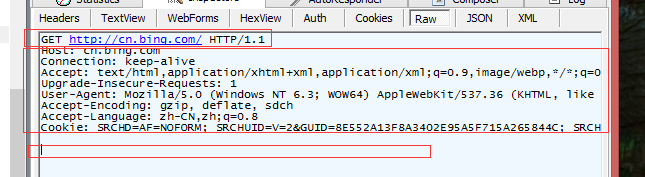

## HTTP学习

>超文本传输协议（HTTP，HyperText Transfer Protocol)是互联网上应用最为广泛的一种网络协议。所有的WWW文件都必须遵守这个标准。设计HTTP最初的目的是为了提供一种发布和接收HTML页面的方法。

<!--more-->

类似客户端发送一个Request请求，包含一些信息，服务器接收到Request后进行处理，生成相应的Response，然后发送给客户端，客户端解析。

另外，http协议是无状态的，同一个客户端的这次请求和上次请求是没有对应关系，对http服务器来说，它并不知道这两个请求来自同一个客户端。 为了解决这个问题， 引入了Cookie机制来维护状态.

### http请求（Request）

Request消息包含三个部分：1、请求行；2、http header；3、body。其中header和body之间有个空行。结构如下图：

#### 请求行
请求行中的Method表示请求方法，比如get、post等；Path-to-resource表示请求资源的位置；http/version-number表示http协议的版本号。

当get方法的时候，body为空。下面为bing.com的请求

post方法的请求如下(github登陆)：

##### 请求方法
HTTP/1.1协议中共定义了八种方法（有时也叫“动作”）来表明Request-URI指定的资源的不同操作方式：

* OPTIONS - 返回服务器针对特定资源所支持的HTTP请求方法。也可以利用向Web服务器发送'*'的请求来测试服务器的功能性。
HEAD- 向服务器索要与GET请求相一致的响应，只不过响应体将不会被返回。这一方法可以在不必传输整个响应内容的情况下，就可以获取包含在响应消息头中的元信息。该方法常用于测试超链接的有效性，是否可以访问，以及最近是否更新。
* GET - 向特定的资源发出请求。注意：GET方法不应当被用于产生“副作用”的操作中，例如在web app.中。其中一个原因是GET可能会被网络蜘蛛等随意访问。
* POST - 向指定资源提交数据进行处理请求（例如提交表单或者上传文件）。数据被包含在请求体中。POST请求可能会导致新的资源的建立和/或已有资源的修改。
* PUT - 向指定资源位置上传其最新内容。
* DELETE - 请求服务器删除Request-URI所标识的资源。
* TRACE- 回显服务器收到的请求，主要用于测试或诊断。
* CONNECT - HTTP/1.1协议中预留给能够将连接改为管道方式的代理服务器。
* PATCH - 用来将局部修改应用于某一资源，添加于规范RFC5789。
方法名称是区分大小写的。当某个请求所针对的资源不支持对应的请求方法的时候，服务器应当返回状态码405（Method Not Allowed）；当服务器不认识或者不支持对应的请求方法的时候，应当返回状态码501（Not Implemented）。
HTTP服务器至少应该实现GET和HEAD方法，其他方法都是可选的。此外，除了上述方法，特定的HTTP服务器还能够扩展自定义的方法。

GET和POST的区别：
1、GET提交的数据会放在URL之后，以?分割URL和传输数据，参数之间以&相连，如EditPosts.aspx?name=test1&id=123456. POST方法是把提交的数据放在HTTP包的Body中。
2、GET提交的数据大小有限制，最多只能有1024字节（因为浏览器对URL的长度有限制），而POST方法提交的数据没有限制。
3、GET方式需要使用Request.QueryString来取得变量的值，而POST方式通过Request.Form来获取变量的值。
4、GET方式提交数据，会带来安全问题，比如一个登录页面，通过GET方式提交数据时，用户名和密码将出现在URL上，如果页面可以被缓存或者其他人可以访问这台机器，就可以从历史记录获得该用户的账号和密码。

#### 请求头 header

If-Modified-Since：把浏览器端缓存页面的最后修改时间发送到服务器去，服务器会把这个时间与服务器上实际文件的最后修改时间进行对比。如果时间一致，那么返回304，客户端就直接使用本地缓存文件。如果时间不一致，就会返回200和新的文件内容。客户端接到之后，会丢弃旧文件，把新文件缓存起来，并显示在浏览器中。

If-None-Match：If-None-Match和ETag一起工作，工作原理是在HTTP Response中添加ETag信息。 当用户再次请求该资源时，将在HTTP Request 中加入If-None-Match信息(ETag的值)。如果服务器验证资源的ETag没有改变（该资源没有更新），将返回一个304状态告诉客户端使用本地缓存文件。否则将返回200状态和新的资源和Etag.  使用这样的机制将提高网站的性能。例如: If-None-Match: "03f2b33c0bfcc1:0"。

Pragma：指定“no-cache”值表示服务器必须返回一个刷新后的文档，即使它是代理服务器而且已经有了页面的本地拷贝；在HTTP/1.1版本中，它和Cache-Control:no-cache作用一模一样。Pargma只有一个用法， 例如： Pragma: no-cache
注意: 在HTTP/1.0版本中，只实现了Pragema:no-cache, 没有实现Cache-Control.

Cache-Control：指定请求和响应遵循的缓存机制。缓存指令是单向的（响应中出现的缓存指令在请求中未必会出现），且是独立的（在请求消息或响应消息中设置Cache-Control并不会修改另一个消息处理过程中的缓存处理过程）。请求时的缓存指令包括no-cache、no-store、max-age、max-stale、min-fresh、only-if-cached，响应消息中的指令包括public、private、no-cache、no-store、no-transform、must-revalidate、proxy-revalidate、max-age、s-maxage。
* Cache-Control:Public 可以被任何缓存所缓存
* Cache-Control:Private 内容只缓存到私有缓存中
* Cache-Control:no-cache 所有内容都不会被缓存
* Cache-Control:no-store 用于防止重要的信息被无意的发布。在请求消息中发送将使得请求和响应消息都不使用缓存。
* Cache-Control:max-age 指示客户机可以接收生存期不大于指定时间（以秒为单位）的响应。
* Cache-Control:min-fresh 指示客户机可以接收响应时间小于当前时间加上指定时间的响应。
* Cache-Control:max-stale 指示客户机可以接收超出超时期间的响应消息。如果指定max-stale消息的值，那么客户机可以接收超出超时期指定值之内的响应消息。

Accept：浏览器端可以接受的MIME类型。例如：Accept: text/html 代表浏览器可以接受服务器回发的类型为 text/html 也就是我们常说的html文档，如果服务器无法返回text/html类型的数据，服务器应该返回一个406错误(non acceptable)。通配符 * 代表任意类型，例如 Accept: */* 代表浏览器可以处理所有类型，(一般浏览器发给服务器都是发这个)。

Accept-Encoding：浏览器申明自己可接收的编码方法，通常指定压缩方法，是否支持压缩，支持什么压缩方法（gzip，deflate）;Servlet能够向支持gzip的浏览器返回经gzip编码的HTML页面。许多情形下这可以减少5到10倍的下载时间。例如： Accept-Encoding: gzip, deflate。如果请求消息中没有设置这个域，服务器假定客户端对各种内容编码都可以接受。

Accept-Language：浏览器申明自己接收的语言。语言跟字符集的区别：中文是语言，中文有多种字符集，比如big5，gb2312，gbk等等；例如：Accept-Language: en-us。如果请求消息中没有设置这个报头域，服务器假定客户端对各种语言都可以接受.

Accept-Charset：浏览器可接受的字符集。如果在请求消息中没有设置这个域，缺省表示任何字符集都可以接受。

User-Agent：告诉HTTP服务器，客户端使用的操作系统和浏览器的名称和版本。
例如： User-Agent: Mozilla/4.0 (compatible; MSIE 8.0; Windows NT 5.1; Trident/4.0; CIBA; .NET CLR 2.0.50727; .NET CLR 3.0.4506.2152; .NET CLR 3.5.30729; .NET4.0C; InfoPath.2; .NET4.0E)。

Content-Type：例如：Content-Type: application/x-www-form-urlencoded.

Referer：包含一个URL，用户从该URL代表的页面出发访问当前请求的页面。提供了Request的上下文信息的服务器，告诉服务器我是从哪个链接过来的，比如从我主页上链接到一个朋友那里，他的服务器就能够从HTTP Referer中统计出每天有多少用户点击我主页上的链接访问他的网站。
例如: Referer:http://translate.google.cn/?hl=zh-cn&tab=wT

Connection：
例如：Connection: keep-alive 当一个网页打开完成后，客户端和服务器之间用于传输HTTP数据的TCP连接不会关闭，如果客户端再次访问这个服务器上的网页，会继续使用这一条已经建立的连接。HTTP 1.1默认进行持久连接。利用持久连接的优点，当页面包含多个元素时（例如Applet，图片），显著地减少下载所需要的时间。要实现这一点，Servlet需要在应答中发送一个Content-Length头，最简单的实现方法是：先把内容写入ByteArrayOutputStream，然后在正式写出内容之前计算它的大小。
Connection: close 代表一个Request完成后，客户端和服务器之间用于传输HTTP数据的TCP连接会关闭，当客户端再次发送Request，需要重新建立TCP连接。

Host：（发送请求时，该头域是必需的）主要用于指定被请求资源的Internet主机和端口号，它通常从HTTP URL中提取出来的。HTTP/1.1请求必须包含主机头域，否则系统会以400状态码返回。

Cookie：最重要的请求头之一, 将cookie的值发送给HTTP服务器。

Content-Length：表示请求消息正文的长度。例如：Content-Length: 38。

Authorization：授权信息，通常出现在对服务器发送的WWW-Authenticate头的应答中。主要用于证明客户端有权查看某个资源。当浏览器访问一个页面时，如果收到服务器的响应代码为401（未授权），可以发送一个包含Authorization请求报头域的请求，要求服务器对其进行验证。

UA-Pixels，UA-Color，UA-OS，UA-CPU：由某些版本的IE浏览器所发送的非标准的请求头，表示屏幕大小、颜色深度、操作系统和CPU类型。

From：请求发送者的email地址，由一些特殊的Web客户程序使用，浏览器不会用到它。

Range：可以请求实体的一个或者多个子范围。例如，
表示头500个字节：bytes=0-499
表示第二个500字节：bytes=500-999
表示最后500个字节：bytes=-500
表示500字节以后的范围：bytes=500-
第一个和最后一个字节：bytes=0-0,-1
同时指定几个范围：bytes=500-600,601-999
但是服务器可以忽略此请求头，如果无条件GET包含Range请求头，响应会以状态码206（PartialContent）返回而不是以200（OK）.

#### 请求体 
post方法会有请求体，请求体是以键值对的形式存在的，各个之间用&隔开。

### http response

